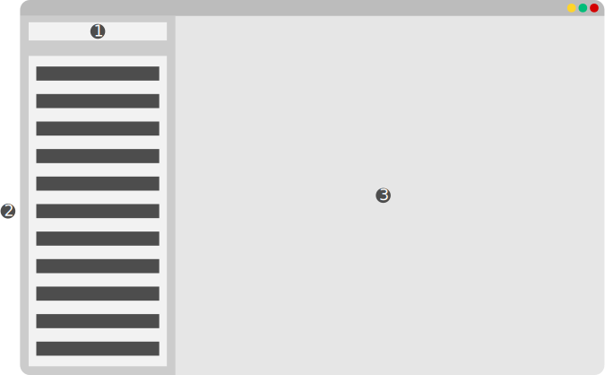

# Some Common Project #1 (SCP #1) - Vocabulary

## Idea

When I was a student at the school, I used the vocabulary for learning English. By "vocabulary", I mean a notebook where I wrote down new words and their translations. So, I decided to implement it programmatically.

My intention is to implement "vocabulary" using only the built-ins of Python. I think it helps me improve my Python skills.

## What am I going to use?

I am going to use `Tkinter` for the GUI and SQLite for storing data.

This section can grow during development.

## Wireframe

Here is a previous wireframe of the vocabulary:

- Number 1 is a text input where you can write and add new words.
- Number 2 is a word list. It can be a `tkinter.Listbox`.
- Number 3 is the main widget of vocabulary. You can write down the translation of your words and some short explanation of your words.
